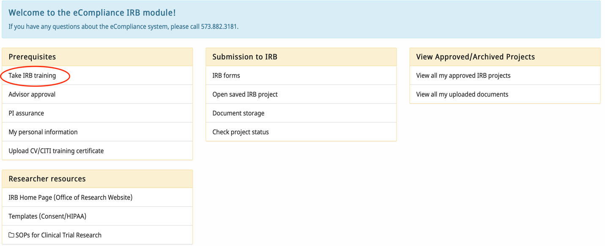
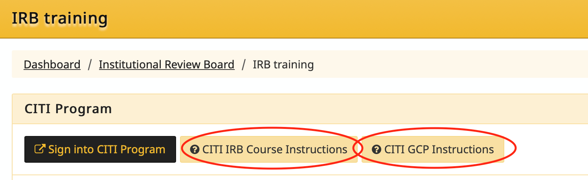
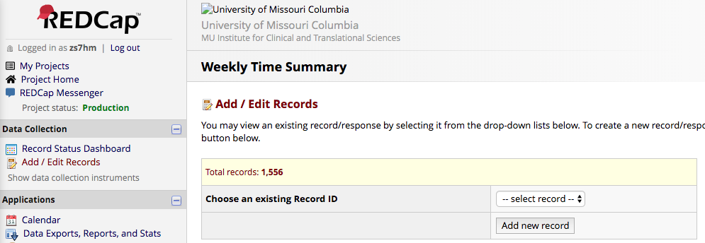
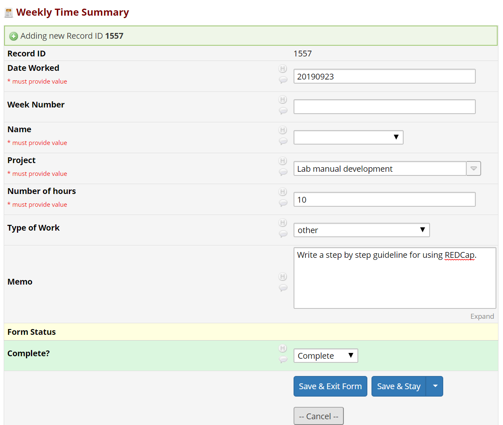
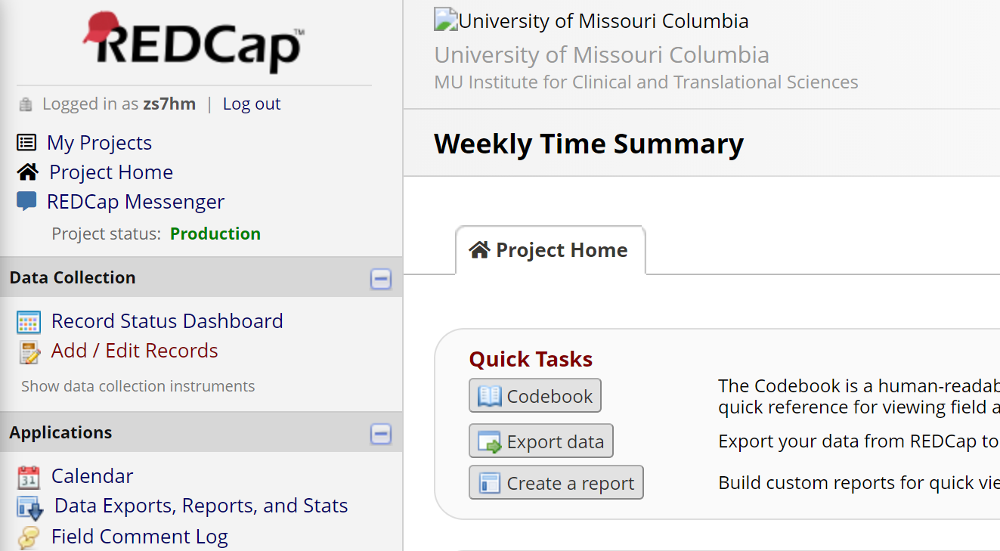
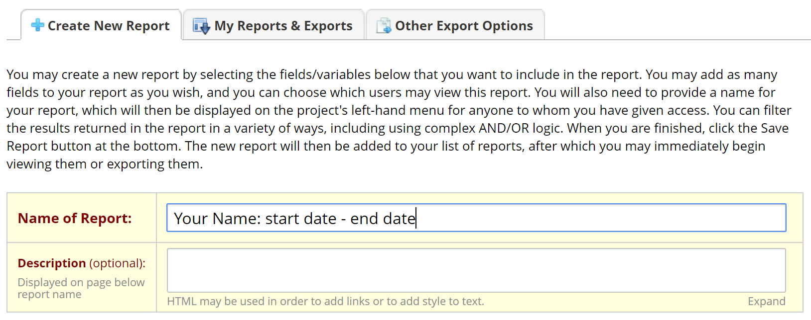
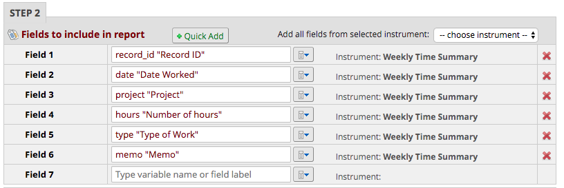
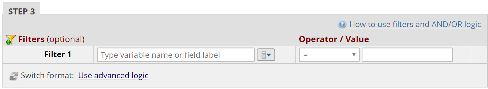
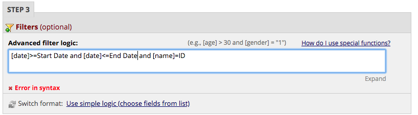

Leary Ortho Biostats Lab Manual
=============================
## Table of Contents

[Introduction](#introduction)

[Lab member expectations and responsibilities](#lab-member-expectations-and-responsibilities)
   
* [Everyone](#everyone)
 
* [Dr. Leary Principal Investigator](#Dr-leary-principal-investigator)
 
* [Postdocs](#Postdocs)
 
* [Graduate students (PhD/Master)](#Graduate-students-phdmaster)
 
* [Lab managers](#Lab-managers)
 
* [Other full-time staff](#Other-full-time-staff)
 
* [Undergraduate students](#Undergraduate-students)

[Code of conduct](#Code-of-conduct)

* [General](#General)

* [COVID-19 Policy](#COVID-19-Policy)

* [Confidentiality Policy](#Confidentiality-Policy)

* [Data Security](#Data-Security)

* [Lab Notebook Policy](#Lab-Notebook-Policy)

* [Schedule Notification](#Schedule-Notification)

* [Scientific integrity](#Scientific-integrity)

* [Human subjects research](#Human-subjects-research)

[Lab Resources](#lab-resources)

* [Github](#Github)

* [Outlook](#Outlook)

* [Outlook Calendar](#Outlook-Calendar)

* [OneNote](#OneNote)

* [Project Management using OneDrive](#Project-Management-using-OneDrive)

[General policies](#general-policies)

* [Hours](#Hours)

* [Meetings](#Meetings)

* [Deadlines](#Deadlines)

* [Presentations/Abstracts](#Presentationsabstracts)

* [Recommendation letters](#Recommendation-letters)

* [Data management](#Data-management)

[Funding](#Funding)

* [Allocation of expenses](#Allocation-of-expenses)

* [Funding notes](#Funding-notes)

[Appendix](#Appendix)

* [MOI dress code](#MOI-dress-code)

* [Zoom Etiquette](#Zoom-Etiquette)

* [Training](#Training)

* [File Formatting](#File-Formatting)

* [REDCap Instruction](#REDCap-Instruction)

* [Datasets available in lab](#Datasets-available-in-lab)

###### 
[Top](#Table-of-contents)

# Introduction
Welcome to the Leary – Ortho Biostats Lab manual. This manual was inspired by other similar works, and borrows heavily from them (e.g., [this one](https://github.com/alylab/labmanual) and [this one](https://github.com/memobc/memolab-manual)). It is intended to represent my vision for how the lab should function and to complement existing University of Missouri policies ([this](https://hrs.missouri.edu/policies-and-procedures) and [this](https://accountability.missouri.edu/accountability/university-policies/), which take precedence). We hope you will learn a lot about clinical statistics, developing new skills (coding, analyzing data, writing and giving talks), making new friends and having a great deal of fun throughout the whole process.

This work is licensed under a CC Attribution 4.0 license. We expect that more information will be added and some sections will be revised as the lab grows and develops. If you have any comments or suggestions regarding the contents of this manual, please tell Dr. Leary (learye@health.missouri.edu).

###### 
[Top](#Table-of-contents)

# Lab member expectations and responsibilities
## Everyone
### Big picture
- Do work that you are proud of. 
- Don’t rush your work. Double-check your work and ask others to look at your code or data if you need help or something looks off. 
- Tell your collaborators if you do make a mistake (if they have already seen the results). We admit our mistakes, and then we correct them and move on.
- No academic misconduct. It is never ok to plagiarize, tamper with data, make up data, omit data, or fudge results in any way.
- Be supportive of your lab mates. Share your knowledge and help them out if they need help.
- Work independently when you can, ask for help when you need it.
- Respect each other’s strengths, weaknesses, differences and beliefs.
- Take personal time/ vacation when you need it and cultivate a life outside of the lab. Respect that other lab members also have a life outside of lab.
- Communicate openly and respectfully with other members of the lab. Dr. Leary would rather know more than she needs to know than less. 
- If there is any tension or hostility in the lab, something has to be done about it immediately. If you don’t feel comfortable confronting the person in question, tell Dr. Leary.

### Small picture
- Do not come into the lab if you are sick. Stay home and get healthy, and don't risk getting others sick.
- Notify Dr. Leary if you will be out, either due to illness or vacation. You need to send an email to Dr. Leary and cc Stacee Clawson (clawsons@health.missouri.edu) and Gigi Harrison (harrisongs@health.missouri.edu). If you are sick and you had experiments or meetings scheduled that day, notify your participants or collaborators and reschedule.
- You aren’t expected to come into lab on weekends and holidays, and you aren’t expected to stay late at night. You are expected to get your work done (whatever time of day you like to do it).
- Show up to your meetings, classes, and exams – just show up for your commitments, and work the hours you need to work to get stuff done.
- Lock the doors if no one else is around, even if you're stepping out for a minute.
- Keep your area tidy. Eating at your desk is fine, but clean up food waste, crumbs, spills. Put equipment back where you found it. Keep common areas uncluttered.
- MOI has a specific dress code, you can check the details at [MOI dress code](#MOI-dress-code). 
- Two trainings (HCUP and IRB) are necessary to be completed before working in the lab. Find details [here](#Training).
- You also need to sign the [Ortho Notebook Policy](https://github.com/zhengyes/lab-manual/blob/master/Files/Ortho%20Notebook%20Policy.pdf) and [DOS National Database Policy](https://github.com/zhengyes/lab-manual/blob/master/Files/DOS%20National%20Database%20Policy.pdf) for the MOI and lab.
- Be on time. Be on time for your meetings: respect that others have packed days and everyone’s time is valuable.

## Dr. Leary-Principal Investigator
All of the [Lab member expectations and responsibilities](#everyone), plus you can expect Dr. Leary to:
- Maintain a vision of where the lab is going
- Provide the funding necessary to keep the lab going
- Be available in person and via e-mail on a regular basis, including regular meetings to discuss your research (and anything else you’d like to discuss)
- Give you my perspective on academia and issues related to professional development
- Support your career development by introducing you to other researchers in the field, writing recommendation letters for you, providing you with opportunities to attend conferences when possible, and promoting your work in talks
- Care about you as a person and not just a scientist

## Postdocs
All of the [Lab member expectations and responsibilities](#everyone), plus you will be expected to:
- Develop your own independent line of research
- Mentor undergraduate and graduate students on their research projects, when asked or when appropriate
- Apply for external funding.
- Apply for jobs (academic or industry) as soon as you are "ready" and/or by the end of beginning of your second year as a postdoc.
- If you are planning to pursue a non-academic career, treat your postdoctoral research as seriously as you might if you were pursuing an academic career. We can discuss ways of making sure that you are getting the training you need, while still doing excellent research.
- Remind the PI that different scientific opinions can co-exist in the same lab!

## Graduate students (PhD/Master)
All of the [Lab member expectations and responsibilities](#everyone), plus you will be expected to:
- (PhD) Develop a line of dissertation research. Ideally, your dissertation research will consist of at least 3 experiments that can be packaged into one thesis document.
- (Master) Plan your master project with advisor and ideally, this can be submitted as at least one paper for peer-reviewed publication.
- Apply for external funding. If nothing else, this is an extremely valuable experience.
- Do some soul-searching as to what type of career you want to pursue, e.g., academic jobs that are research-focused or teaching-focused, non-academic jobs like data science or science writing. We can brainstorm ways of making sure you are getting the training that you need. Your dissertation/thesis research can support and strengthen your career goals, even if not academic.
- Work with a team of undergraduate students or graduate students more junior than you. This will speed up data collection and give you some experience with managing and mentoring a team.
- Stay up-to-date (and keep up-to-date) on any deadlines that you need to meet to fulfill departmental requirements. This is your responsibility not the PI’s.

## Lab managers
All of the [Lab member expectations and responsibilities](#everyone), plus you will be expected to:
- Maintain and monitor the lab IRB protocols and paperwork (e.g., archiving consent forms).
- Oversee the hiring, scheduling, and training of undergraduate and master graduate level research assistants.
- Maintain the lab manual.
- Assist other lab members with data collection or analysis (typically you will be assigned to particular projects).
- Maintain databases and grant data requests.
- Help to maintain an atmosphere of professionalism within the lab.
- Work on your own research project.

## Other full-time staff
All of the [Lab member expectations and responsibilities](#everyone), plus you will be expected to:
- Work on your own research project.
- Assist other lab members with data collection or analysis (typically you will be assigned to particular projects).
- Help to maintain an atmosphere of professionalism within the lab.
- Provide extra support to the lab manager and PI.

## Undergraduate students
All of the [Lab member expectations and responsibilities](#everyone), plus you will be expected to:
- Assist other lab members with data collection or analysis (typically you will be assigned to particular projects).
- Work with the lab manager and/or your research mentor to determine your weekly schedule. If you are not able to come in during your normal scheduled time, you must let the lab manager or research mentor know.
- Provide extra support to the lab manager (this may include filing paperwork). If you are in lab and do not have a task to do, you should ask the lab manager or your supervisor whether there is anything you can help out with. You should not be idle.

Undergraduate research assistants play an important role in our lab, and we have a few opportunities for them to earn money or credit for their contributions. Because these opportunities require a certain degree of commitment from both the student and the lab, we generally reserve them for students who have already spent at least one semester volunteering in lab. If this policy would prevent you from being able to work in lab, please talk to Dr. Leary or the lab manager because we want all students to be able to pursue their research interests. In addition to volunteering in lab, other research opportunities include data collection.

###### 
[Top](#Table-of-contents)

# Code of conduct
## General
Many topics were covered already in the [Lab member expectations & responsibilities section](#Lab-member-expectations-and-responsibilities).

## COVID-19 Policy
Many meetings will be moved online (see [Meetings](#Meetings)) but any in-person meetings need to follow COVID-19 policies. When meeting, please wear a mask and stay home if you are experiencing any flu-like symptoms. Contact Dr. Leary, your healthcare provider, and get proper treatment. Sanitize all equipment after use and remain courteous of personal space.

## Confidentiality Policy
We expect all the lab members to exercise reasonable care in the disclosure, use and management of restricted information about patients, patient care, personnel, students and the fiscal affairs of University of Missouri Health. 

Protected Health Information (PHI) is confidential. This includes all patient information, whether in electronic, audio, photo, video or paper form. We expect all lab members to protect and preserve this confidentiality. 

MU Health operates under the requirements of the Health Insurance Portability and Accountability Act (HIPAA) Privacy and Security Rules and the Health Information Technology for Economic and Clinical Health (HITECH) Act. The HIPAA Security Rules require MU Health and our business associates to use administrative, physical and technical safeguards to ensure the confidentiality, integrity and availability of electronic protected health information (PHI). 

We do not access, obtain, disclose or discuss PHI without written authorization from patients or their legal representatives, unless necessary for treatment, payment or health care operations, or required by law. We also follow the “Minimum Necessary Rule” which means employees, faculty and staff have the right to access only the patient information necessary to perform our respective jobs. If you have questions regarding access to PHI, please contact Dr. Leary first. The System Privacy Office is available at (573) 882-3293.

### HIPAA 
The Health Insurance Portability and Accountability Act (HIPAA), which became law in 1996, was intended to improve health insurance information portability and to simplify the administration of health care information.  The Administrative Simplification provisions of HIPAA dictated that national standards for electronic health care transactions and code sets; and national identifiers for providers, health plans, and employers were established which were intended to ensure security and privacy of health information.  This resulted in the improvement of the efficiency and effectiveness of the health care system through the establishment of standards for electronic data interchange. 

The HIPAA Privacy Rule protects all "individually identifiable health information" held or transmitted by a covered entity or its business associate, in any form or media, whether electronic, paper, or oral. The Privacy Rule calls this information "protected health information (PHI)."

“Individually identifiable health information” is information, including demographic data, that relates to:

* the individual’s past, present or future physical or mental health or condition,
* the provision of health care to the individual, or
* the past, present, or future payment for the provision of health care to the individual,
and that identifies the individual or for which there is a reasonable basis to believe it can be used to identify the individual. Individually identifiable health information includes many common identifiers (e.g., name, address, birth date, zipcode, Social Security Number). 

Dr. Leary will generally send you the data without identifiable health information. All work, and particularly data, should be stored on Box or the Ortho Biostats server space (Z drive) as it is compliant with DSL 4, HIPAA, and HITECH guidelines. Box accounts must be configured to comply with HIPAA requirements. Any identifiable data posted on the lab OneNote should be password protected. Any identifiable data cannot be viewed or studied unless you are listed as study personnel on that studys' IRB.

## Data Security
We must exercise reasonable care in the disclosure, transmission, access, use and management of confidential information about patients, patient care, personnel, students and proprietary business affairs of University of Missouri Health. 
As stated in the University of Missouri Acceptable Use Policy, electronic information on MU Health networks or equipment, including, but not limited to, electronic mail and personal information, is subject to examination when: 
*	It is necessary to maintain or improve the functioning of our computing resources. 
*	There is suspicion of misconduct under MU Health policies or suspicion of violation of federal or state law. 
*	It is necessary to comply with or verify compliance with federal or state law. 

Protecting confidential information is a priority within our health care system: 
*	Do NOT access patient information unless you need the information to do your job. Inappropriate access to patient information will lead to disciplinary action and possible dismissal from the lab. 
*	You are to access only the minimum information necessary to accomplish your assigned job duties. This includes all information in paper and electronic form. 
*	Only discuss patient information with authorized personnel and in a private location where unauthorized persons cannot overhear even if you are not using patient names. 
*	Do NOT give information about patients or staff to anyone over the phone.
*	Shred or place confidential information in receptacles specifically used for confidential waste disposal. Never put confidential waste in recycle bins or the regular trash. 
*	[The Access and Confidentiality Agreement](https://www.umsystem.edu/media/is/infosec/confidentiality-agreement.pdf) must be read and signed by all instructors and all lab members. 
* Some more information about MU health confidentiality can be found [here](https://medicine.missouri.edu/centers-institutes-labs/health-ethics/faq/confidentiality).

## Lab Notebook Policy
Upon your involvement in research at the Department of Orthopaedic Surgery, you will be provided a notebook to aid in your work. Research or "lab notebooks" are an essential part of doing scientific research. The purpose of this notebook is to have an organized location for you to record and store notes and protocols about the research projects you are involved in through the department. This will help you to keep track of your work and allow you and others to review the steps taken during your analyses.

### Expectations
This notebook:
*	should be labeled with your name and contact information,
*	should be brought to every meeting with Dr. Leary,
*	should be legible and kept in good condition,
*	should contain notes from meetings and a detailed account of the statistical analyses you perform,
*	should be organized and detailed enough for someone else to read and understand what you did,
*	should not contain notes for other courses or projects outside of the Department of Orthopaedic Surgery.
* should be in English, other languages should only be used for notes to yourself regarding English terms.

### Security
All notebook holders should consider the sensitivity of the information that might be contained within the notebook in order to minimize dissemination of unauthorized information. Due to the sensitive nature of the data that you will be working with, the Department of Orthopaedic Surgery retains the right to confiscate this notebook anytime during or after your involvement with any affiliated research projects. At the end of your time with the lab, please turn in your lab notebook.

## Schedule Notification
For all lab members, your particular work of the previous week and work schedule for the following week will be discussed and assigned during the weekly meeting. 

The lab meeting is obligatory for each member. If you will be absent for some particular reason for the lab meeting, reasonable notification needs to be made to Dr. Leary. For students, schoolwork is priority, however you need to communicate with your supervisors when your schoolwork conflicts with Lab work and it is necessary to reduce work hours.

**In addition:**

All members of the lab, along with visitors, are expected to agree with the following code of conduct. We will enforce this code as needed. We expect cooperation from all members to help ensuring a safe environment for everybody. Please also see the University of Missouri [NONDISCRIMINATION POLICY](https://www.umsystem.edu/ums/rules/collected_rules/equal_employment_educational_opportunity/ch600/600.010_equal_employment_educational_opportunity_policy).

The lab is dedicated to providing a harassment-free experience for everyone, regardless of gender, gender identity and expression, age, sexual orientation, disability, physical appearance, body size, race, or religion (or lack thereof). We do not tolerate harassment of lab members in any form. Sexual language and imagery are generally not appropriate for any lab venue, including lab meetings, presentations, or discussions. Harassment includes offensive verbal comments related to gender, gender identity and expression, age, sexual orientation, disability, physical appearance, body size, race, religion, sexual images in public spaces, deliberate intimidation, stalking, following, harassing photography or recording, sustained disruption of talks or other events, inappropriate physical contact, and unwelcome sexual attention.

Members asked to stop any harassing behavior are expected to comply immediately.

If you are being harassed, notice that someone else is being harassed, or have any other concerns, please contact Dr. Leary immediately. If Dr. Leary is the cause of your concern, then please reach out to Ms. Stacee Clawson, Dr. James Cook or another trusted department member who can assist.

We expect members to follow these guidelines at any lab-related event or activity.

>This section was adapted from: code of conduct. Original source and credit: http://2012.jsconf.us/#/about & The Ada Initiative. This work is licensed under a Creative Commons Attribution 3.0 Unported License.

## Scientific integrity
### Reproducible research
Reproducible research is research that can be exactly reproduced given the *same* raw data. It is an *essential* part of science, and an expectation for all projects in the lab. Reproducibility is related to replicability, which refers to whether your results can be obtained again with a *different* data set. We expect that all of our research will be replicable, or at least reproducible.

For results to be reproducible, it requires that you are organized and possess sufficient foresight to document each step of your research process. There are two main things you can do to improve the reproducibility of your research:
- Extensive notetaking. You will need extensive notes on each step of your analysis pipeline, explaining how you did things every step of the way (and the order that you did things), from any pre-processing of the data, to running models, to statistical tests. Your code should also be commented clearly so that every step is understandable by an outsider. 
- Programming workflows with version control. It is highly encouraged that you use some form of version control (e.g., Git in combination with GitHub or file naming conventions for code saved to Box or other storage locations) to keep track of what code changes you made and when you made them, as well as sharing code with others.

### Authorship
We will follow NIH guidelines with respect to authorship

>"Authorship credit should reflect the individual's contribution to the study. An author is considered anyone involved with initial research design, data collection and analysis, manuscript drafting, and final approval. However, the following do not necessarily qualify for authorship: providing funding or resources, mentorship, or contributing research but not helping with the publication itself. The primary author assumes responsibility for the publication, making sure that the data are accurate, that all deserving authors have been credited, that all authors have given their approval to the final draft; and handles responses to inquiries after the manuscript is published."

Authorship will be discussed prior to the beginning of a new project, so that expectations are clearly defined. However, changes to authorship may occur over the course of a project if a new person becomes involved or if someone is not fulfilling their planned role. In general, graduate students and postdocs will be first authors on publications on which they are the primary lead, and Dr. Leary will be the last author.

#### Old projects
If a student or post-doc collects a dataset but does not completely analyze it or write it up within 2 years after the end of data collection, Dr. Leary will re-assign the project (if appropriate) to another person to expedite publication. If a student or post-doc voluntarily relinquishes their rights to the project prior to the 2-year window, Dr. Leary will also re-assign the project to another individual. This policy is here to prevent data (especially expensive data) from remaining unpublished but is meant to give priority to the person who initially led the project.
## Human subjects research
Adherence to approved IRB protocols is *essential*, and non-adherence can lead to severe consequences for the entire lab. **All lab members must read and comply with the IRB consent form and research summary for any project that they are working on.** If you are not on the IRB, you cannot look at identifiable data, analyze the data, or be in any way involved with the project. Check [here](#training) to see details about the training for IRB.

Lab members must also complete the CITI training and save their certificate. To be added to an existing IRB, talk to the lab manager and present them with your CITI certificate before you can work with human subjects. If there are any questions about the protocols, or if you're not sure whether we have IRB approval to run your study, please ask the lab manager or Dr. Leary for clarification. If necessary, the lab manager or Mr. Eric Zelasko (zelaskoe@health.missouri.edu) can file an amendment to an existing protocol or create a new protocol.

If you encounter any problems in the course of doing research that results in a negative outcome for the participant (e.g., if a participant becomes ill or upset, if there is an accident with the equipment, if there is a breach of confidentiality, etc), you should immediately seek assistance from Dr. Leary or the lab manager. If Dr. Leary is not around, you must notify Dr. Leary and the lab manager *within 24 hours*, preferably as soon as possible. In some cases, we may need to report this information to the IRB and/or our funding agencies.

###### 
[Top](#Table-of-contents)

# Lab Resources
## GitHub
GitHub is a hosting service. Projects on GitHub can be accessed and manipulated using the standard Git command-line interface and all of the standard Git commands work with it. GitHub also allows registered and non-registered users to browse public repositories on the site. All members must register an account in order to contribute to discussion and manage repository. This lab manual is on GitHub and the corresponding lab wiki is also on GitHub. Please check the [lab manual](https://github.com/LearyE/Ortho-Biostats) and [lab wiki](https://github.com/LearyE/Ortho-Biostats/wiki) first,  if you have any lab related questions. 

## Outlook
Outlook is primarily an email application, it also includes a calendar, task manager, contact manager, note taking, journal, and web browsing. Using Outlook is required for the lab.

Tasks can be assigned via Outlook (email) through OneNote, so all members are expected to check emails every day and to respond to emails throughout the week (weekends excluded).

## Outlook Calendar
Outlook Calendar is within Outlook. It can help to arrange and manage meetings and events. Dr. Leary will send notifications about meeting location and time via Outlook Calendar. Please keep your Outlook Calendar connected and up to date.

## OneNote
OneNote is a digital notebook for taking notes and managing information. Notes can be shared with other OneNote users over the internet or network. Relevant notes from the lab meeting or tasks will be posted on OneNote and sent through Outlook. OneNote will be used as our project management tool, to communicate/share project progress (through tasks etc.) and using email.

## Project Management using Ortho Biostats Drive
Dr. Leary will assign each lab member an Ortho Biostats drive (Z drive) folder with your name. This folder must contain all the materials of your projects. Do not save any project materials on a computer or in another cloud service. If system lags make this impossible, all material must be moved to the Ortho Biostats drive each week. Box can also be used instead. This issue should be temporary (as of Nov 2020) but it is important that best practices be followed as closely as possible, while also not hindering working abilities. 
### OneDrive
OneDrive is a tool that allows you to sync data stored on Microsoft Office to your desktop. It essentially allows OneDrive to function as a cloud "drive" on your computer. You can navigate and modify content stored on the OneDrive website through your computer’s native file browsing interface, without using a web browser. You must log in to your Microsoft account every time you wish to use it. To install OneDrive, please check [this](https://support.microsoft.com/en-us/office/sync-files-with-onedrive-in-windows-615391c4-2bd3-4aae-a42a-858262e42a49) if you have problem about installing or setting sync folder. Currently (Nov 2020), OneDrive is not approved for patient data. This tool will likely be approved in the future. However, it is currently available for non-PHI data and related storage needs.

###### 
[Top](#Table-of-contents)

# General policies
## Hours
One of the benefits of a career in academic research is that it is typically more flexible than other kinds of jobs. However, you should still treat it like a job. If you are employed for 40 hours a week, you should be working 40 hours a week. This applies to lab staff members (the lab manager and other research assistants) and postdocs. You are not required to work over-time. For graduate students, you are recognized to have other demands on your time like classes and TA-ing but we still expect to see you in lab, doing research, often. Lab staff members are expected to keep regular office hours (e.g., somewhere in the ballpark of 8-5). Graduate students and postdocs have more flexibility. 

### Office hours
Dr. Leary is generally in her office (MOI room 4216) from 8 a.m. to 5 p.m. on weekdays. Due to COVID-19, she is mainly working remotely, but is still available in the given time frame. You can send her an email if you cannot find her. The lab office is room 4218 at Missouri Orthopaedic Institute.

## Meetings
### Weekly lab meetings
Weekly lab meetings will be focused on project presentations and going over new data or methods. The weekly lab meeting is currently occurring remotely (via Zoom) every Tuesday at about 1 p.m., meetings usually last about 1 to 1.5 hours. If the location or time changes, Dr. Leary will email you in advance. If at the end of meeting, we need more time to discuss something, we will schedule another meeting. Lab meeting agendas and notes must be updated and maintained by each lab member. This is located in the `lab meetings` folder on Box. All lab members are expected to attend the weekly lab meeting. 

### Individual meetings

## Deadlines
It is essential to stay ahead of deadlines and keep organized. When it comes to deadlines, tell your collaborators **as soon as you know when a deadline is**, and make sure they are aware of it the closer it gets. Don’t be afraid to bug them about it.

Dr. Leary will expect advance notice of at least 2 weeks for reading/commenting on abstracts, papers, and manuscripts, 2 weeks for filling out paperwork, etc, and 2 weeks for letters of recommendation. If you want feedback on research and teaching statements, or other work that requires multiple back-and-forth interactions between you and Dr. Leary before a hard deadline, give her as much time as you can.

## Presentations/Abstracts
It is highly encouraged that you seek out opportunities to present your research, whether it is at departmental talk series and events, to other labs at conferences, or to the general public. Abstracts from work done in the lab must be approved by all authors (and Dr. Leary) prior to submission. If you are going to give a presentation (a poster or a talk), be prepared to give a practice presentation to the lab at least one week ahead of time (two weeks or more are advisable for conference presentations, and many weeks ahead of time are advisable for job talks, which require a lot of refining).  Practice talks will help you feel comfortable with your presentation, and will also allow you to get feedback from the lab and implement those changes well in advance of your real presentation.

Templates for posters are available at [here](https://missouri.app.box.com/s/whqy3iw5hefqrdcxhw69f06e0gc9pww8), and those are highly recommended, particularly for orthopaedic focused conferences. Some general rules for posters should be followed: minimize text as much as possible (if you wrote a paragraph, you’re doing it wrong), make figures and text large and easy to see at a distance, label your axes, and make sure different colors are easily discriminable. 

## Recommendation letters
Letters of recommendation are one of the many benefits of working in a research lab. You can count on Dr. Leary to write a letter if you have spent at least 6 months in the lab. (It’s hard to really know someone if they have only been around for a few months.) Exceptions can be made for shorter-term lab members in special circumstances (e.g., new graduate students or postdocs applying for fellowships). 

To request a letter of recommendation, please adhere to the deadline requirements described above, your current CV and any relevant instructions for the contents of the letter. Your specific aims or a short summary are required if you are applying for a grant. In some but not all cases, you may be asked to draft a letter, which will be revised to be consistent with evaluation. This will ensure that the letter contains all the information you need, and that it is submitted on time.

## Data management
### Storing active datasets (need to complete)
In general, data will be stored in one of four places:
- Your assigned box folder
- Ortho Biostats Drive (Z drive)
- H drive (Ortho server)

### Data organization
The projects will have the following folders in each project folder for consistent project management (Data, Program, Output, Reports). 

*	Data – put all Data here, initial data, formatted data, data dictionaries etc. You should keep the original data in a folder labeled "Original". Put all datasets you created in an archive folder so that other members can check the data at anytime, without rerunning your code. Final version for all analyses must be exported to .csv format and have a corresponding data dictionary. Aim to be consistent with the way data is organized between documents to allow for an easier transition into R.
*	Programs – put all R code here or any other code. You must save your R code each time you revise it - please use a date in your file name (YYYYMMDD). You must annotate all of your R code. It may be years until you need to re-visit a project (or I may need to later on). Annotate your code! 
*	Output – put all calculated tables, figures, and other output here. You must save your R workspace here. Date your files using the filename.
*	Reports – put all report drafts here as well as any other reporting documents or data. Date your files in the filename.

You should use an organization scheme like the above one. When you archive the dataset, you will be required to format it like the above (or something similarly transparent in its organization), so it might as well start that way. 

### File management
You must save each file with the date in the filename using the following format, “yyyymmdd”. For example, if I were saving a report for an ACL project on Aug 10, 2017 it would be saved as “Report_ACLproject_20170810.docx”. It is extremely important that the R code file matches the R workspace file – this is why putting dates in the file names are so important. Never delete old files – they should all have different names (because of the date at the end) and be placed in an “OLD” subfolder, within each project folder. 

### Basic Data Management
All data must be checked for validity, reasonability, and formatting. Sometimes missing data are denoted by “.”, “_”, “NA”, “NaN”, “-99” or “9999”. Or sometimes values are incorrect, for example, if you have a negative weight or weigh 9999lbs. If you do not check, these can be included in calculated means and other analyses. These may need to be re-coded – this is fine as long as this is documented in the report. 

All statistical assumptions must be met prior to analysis. If assumptions are not met, investigate other approaches (e.g. non-parametric) or by combining categories for small cell counts. 

### Archiving inactive datasets
Before you leave the lab, you will be required to document and archive all datasets that you have collected or analyzed. The dataset will be reviewed before you leave. Please move the data to your Box folder (or OneDrive or Ortho Biostats Drive), and make sure annotated codes are included and will run data (e.g. produce the final data). 

### Data sharing
Not only is data-sharing the right thing to do, we are actually required to do so for any dataset that was funded by the NIH. The final datasets must be archived in .csv format with a complete data dictionary. You should also be prepared to share any scripts or code that you used in your published processing & analysis pipeline. Dr. Leary will be responsible for sharing all final data; you are responsible for formatting and organizing your data so she can do that.

###### 
[Top](#Table-of-contents)

# Funding

## Allocation of expenses
Dr. Leary will oversee all aspects of the financial management of lab funding sources. However, it is important to be transparent about where research money comes from and how it's spent. Dr. Leary has included some notes below but please do not hesitate to ask if you want to know more details.
* MOI/TLRO: These funds are flexible in that they can be used for any justifiable purpose.
* NIH: NIH funds are restricted to these projects only.
* DoD: Department of Defense (DoD) funds are restricted to these projects only. 
* SOM or Internal funds: these funds are restricted to these projects only.
* Other funds: Sometimes the lab receives small amounts of unrestricted funds from the
university; these can be spent in the same way as MOI/TLRO funds.

## Funding notes
All research funded by the NIH and DoD must acknowledge the grant number upon publication. This is essential for documenting that we are turning their money into research findings. We must also submit a yearly progress report describing what we have accomplished. Lab members involved in the research will be asked to contribute to the progress report.
Research funded by other grants (e.g., SOM funding) must also acknowledge the source of funding and provide a statement which whatever other funding source provides.

###### 
[Top](#Table-of-contents)

# Appendix

## MOI dress code

Dress Code Policy
Category: Workplace
Policy ID: HR-5005-UMHC
Title: Dress Code
Purpose: To establish standards of dress which are appropriate in carrying out patient care and other related work assignments throughout University of Missouri Health Care (MUHC).

Policy: Staff are required to follow the hospital-wide dress code outlined here, as well as departmental standards for correct uniform/scrubs or business attire. The standards of this policy, as well as departmental standards, are to be complied with by staff or student during their regular scheduled work times, as well as during any returns to the hospital (“call”, extra work hours).

Procedure: STANDARDS
1.	General Appearance
*	Staff appearance should convey an image of competence and seriousness of purpose that inspires confidence in our patients, visitors and fellow staff members.
*	Personal hygiene should be maintained and body free of unpleasant odor.
*	Fingernails should be kept clean and trimmed. Artificial nails are prohibited for anyone providing direct patient care.
*	Mustaches/beards and sideburns should be neatly trimmed.
*	Hair shall be cleaned, neatly combed, and if longer than shoulder length, worn in such a way as to not interfere with required job duties.
*	The use of jewelry should not be excessive and should not unreasonably draw attention to the wearer. Jewelry that would pose a safety issue to the wearer or others is not permitted.
*	All tattoos shall be free of emblems, slogans, or symbols that depict alcohol, illicit substances or paraphernalia, gang-related, intolerant beliefs, nudity, sex, obscene language, gambling, or antisocial comments/graphics, or must be covered on duty.
2.	Clothing
*	Clothing should be clean and in good repair. Clothing should be without holes or frayed areas and appropriate for the specific activity in which employees are engaged. Radical departure from the normal business attire is not permitted.
*	Clothing should be of appropriate size style so that it covers all necessary areas of the body. Undergarments should not be visible. 
*	All clothing shall be free of emblems, slogans, or symbols that depict alcohol, illicit substances or paraphernalia, gang-related, intolerant beliefs, nudity, sex, obscene language, gambling, or antisocial comments/graphics.
*	Shoes should be appropriate to the work being performed and should be non-noise producing in patient areas.
*	All uniform requirements must be followed per department standards.
3.	I.D. Badges
*	Appear appropriately attired with ID badge worn at eye level, just below the shoulder with the name clearly displayed.
*	I.D. badges are the property of University of Missouri Health Care and are not to be defaced or abused. No items are to be affixed or attached to the badge either temporarily or permanently.
*	No lettering, drawing, or wording other than what was issued on the badge is permitted. For more detailed information, refer to Policy HR-5017, Photo Identification Badges.

Department managers may establish departmental standards as appropriate and monitor the need for periodic updates. Departmental standards should be in keeping with the purpose of the general dress code policy of the University of Missouri Health Care and be no less restrictive.

Conflicts with the Hospital dress code or departmental standards arising from staff who request special accommodation, should be referred to Human Resources.

## Zoom Etiquette
Show up to Zoom meetings ready to speak and, if possible, with your camera on (required for lab meetings.) Act with the same protocol in person meetings have and follow MOI dress codes (more casual can be ok.) Prior to [weekly lab meetings](#Weekly-lab-meetings), please update your slide on Box with work done throughout the past week and come prepared with possible questions and comments. 
 
## Training

1. Training for IRB Approval:

Go to this [website](http://ecompliance.missouri.edu/login) to set up an eIRB account. Sign in using your MU pawprint and password and complete it. After setting up your eIRB account, you will enter the Institutional Review Board Compliance Module in eIRB and under “Prerequisites” you will choose “Take IRB Training” as shown in the figure below. 

Then you will sign into the CITI Program and follow the enclosed IRB course instructions (Make sure you are affiliated with the University of Missouri- Columbia).

Once you have completed the IRB training, you will need to add the GCP training and follow the GCP instructions next to “IRB course instructions”. The page of IRB course instructions and GCP instructions are shown in the figure below.

When you complete these trainings, save your completion certificates as .pdf files and email to Ms. Vicki Jones (jonesvicki@health.missouri.edu) and cc Dr. Leary.

2. Data Use Agreement (DUA)

* DUA for NIS/HCUP:
    *All personnel will need to fill out and sign the data use agreement and **send it to Dr. Leary**. It is located [here](https://www.hcup-us.ahrq.gov/team/NationwideDUA.pdf).  

* DUA for NSQIP: [here](https://www.facs.org/-/media/files/quality-programs/nsqip/datauseagreementacsnsqippuf.ashx?la=en). 

3. Swirl R Coding (Optional)

* Coding using R is utilized heavily in the lab's data analysis. Learning the fundamentals of this coding software can aid current and future research.

* Link to Swirl: [here](https://swirlstats.com/students.html). If you need help installing and getting started, follow the steps listed on the website.

* Link to Swirl Repository: [here](https://github.com/swirldev/swirl_courses#swirl-courses). This will give you the instructions to download the interactive courses that will teach you the fundamentals of R.

## File Formatting

*	All Word Files must be changed to the English language and all reports must be spell-checked (in English!). 
*	All tables and figures must have a title.
*	All figures must have labels for both the y-axis and the x-axis. These labels should also be formatted for presentation. 

## REDCap Instruction

We use REDCap to track hours and record what you have done weekly, it can help us to manage your work and make a long-term plan for both of you and our projects. Go to [Show Me Portal](https://medicine.missouri.edu/research/investigator-resources/show-me-portal/show-me-portal-resources), scroll down and find "REDCap", click the yellow button "LAUNCH REDCAP" and login with your pawprint and password.

Here is the procedure for reporting your weekly hours:

* Step 1. After loggin into REDCap home page, click "My Projects" on the top menu, then click "Weekly Time Summary". 

* Step 2. Now you need to add hours to REDCap. Click "Add/Edit records", then click "add new record" to start a new record. 

* Step 3. Fill out all details for your record. The "Date Worked" should be in the format "yyyymmdd". Select your name for "Name" and choose the name which describes your project for "Project". If the correct project is not available, please contact the lab manager and cc Dr. Leary. It is important for project tracking and hr that time is appropriately assigned to the correct project. Enter your hours and type of the work. In the Memo section, you need to provide details about the work you have done for this project. Click "Save & Exit Form" when you finish. Here is an example. You can always go to Step 1 to add a new record. 

* Step 4. Now we need to create a report for all your records. Click "Project Home", click "Create a Report" under the "Quick Tasks", then we go to a new page to create new report. You will need your ID number in this project, click "Codebook" under the "Quick Tasks", you will find a list of names for the "Name" vairable. Keep the number in front of your name, We will use it in Step 6.#####

* Step 5. Type your name and project start date and end date in the "Name of Report" blank. A period of a regular week starts from Sunday and ends on Saturday.

* Step 6. Add the fields which will be included in the report. The following fields are recommended in your report.

* Step 7. The "filters" settings can let REDCap only show the records for specific person and for specific time period (last week). Click "Use Advanced Logic" to set up.

* Step 8. In the "Advanced filter logic" box, type the following. You can get the ID number in Step 4. After this, click "Save Report", a report for specific ID and time period will be generated and appear in the "Reports" section in the left.

* Step 9. After finishing all the above, go to the "Reports" section in the left and click your report. You will see all the records you have added for this week. Make a screenshot of the report and send it to Dr. Leary. This must be done before Monday 8 a.m. each week . In addition, in this email you need to provide a detailed description of your progress for each project during the week. 

## Datasets available in lab

### NHIS

The National Health Interview Survey (NHIS) has monitored the health of the nation since 1957. NHIS data on a broad range of health topics are collected through personal household interviews. For over 50 years, the U.S. Census Bureau has been the data collection agent for the National Health Interview Survey. Survey results have been instrumental in providing data to track health status, health care access, and progress toward achieving national health objectives. Some more information can be found [here](https://www.cdc.gov/nchs/nhis/index.htm).

### MEPS

The Medical Expenditure Panel Survey (MEPS) is a set of large-scale surveys of families and individuals, their medical providers, and employers across the United States. MEPS is the most complete source of data on the cost and use of health care and health insurance coverage. Some more information can be found [here](https://meps.ahrq.gov/mepsweb/)

### NIS

The National Inpatient Sample (NIS) is part of the family of databases and software tools developed for the Healthcare Cost and Utilization Project (HCUP). The NIS is the largest all-payer inpatient care database in the United States, containing data on more than seven million hospital stays. Its large sample size is ideal for developing national and regional estimates, and it enables analyses of rare conditions, uncommon treatments, and special populations. We paid for this dataset, please contact Dr. Leary if you need help. Some more information can be found [here](https://www.hcup-us.ahrq.gov/news/exhibit_booth/nis_brochure.jsp). 

### NSQIP

The ACS National Surgical Quality Improvement Program (ACS NSQIP®) is a nationally validated, risk-adjusted, outcomes-based program to measure and improve the quality of surgical care. Built by surgeons for surgeons, ACS NSQIP provides participating hospitals with tools, analyses, and reports to make informed decisions about improving quality of care. Further, peer-reviewed studies have shown that ACS NSQIP is effective in improving the quality of surgical care while also reducing complications and costs. We paid for this dataset, please contact Dr. Leary if you need help. Some more information can be found [here](https://www.facs.org/quality-programs/acs-nsqip)
###### 
[Top](#Table-of-contents)

